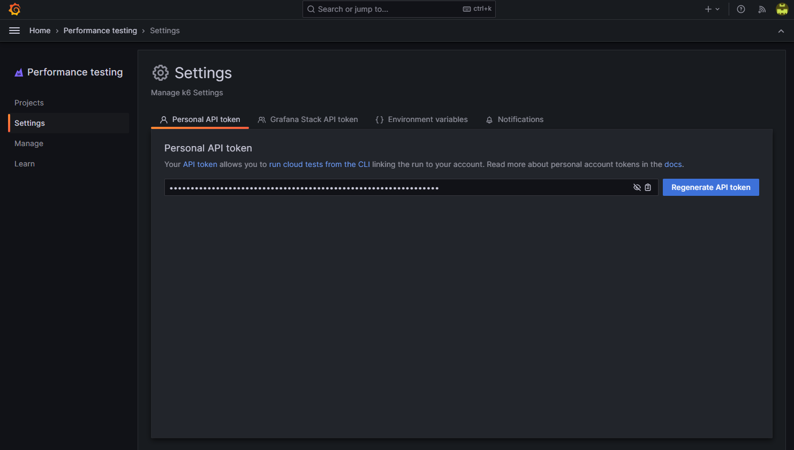

## Breakout 1: k6 scripting

The first breakout will familiarize you with the basics of scripting with k6.

### 1: Creating the script

To begin, open up a terminal and use it to create a new file called `script.js`, then open it for editing.

Our first exercise will be to create a script that will send a GET request to the recommendations endpoint. Copy the code below into your script, and make sure to replace `<YOUR USERNAME>` in the URL with the username provided in your welcome email:

```javascript
import http from 'k6/http'

export const options = {
  vus: 1,
  iterations: 1
}

export default function() {
  http.get('https://<YOUR USERNAME>.work-shop.grafana.net/api/recommendations')
}
```

Lets break down what's in the script:

- There is an initial `import` of the k6 `http` client, which will be used to make HTTP requests.
- We then declare and export a `options` object. As indicated by the name, this object allows you to define a myriad of options that influence how the script runs. In this case, we set both `vus` and `iterations` properties to `1`. Doing so will result in a single execution of the code inside the `default function` when the script is run.
- Finally, we declare and export a `default function` that contains the code for making the HTTP GET request. We see here `http.get` being used in its simplest form, namely a single parameter specifying the URL that the GET request should be sent to. There are, however, overloads to the function that cater for sending additional parameters such as headers. We'll see some examples of that later on.

### 2: Running the script

Now, lets run it! Save the script and then using your terminal, navigate to the folder that the script resides within. Execute the following command to run the script:

```
k6 run script.js
```

NOTE: If you see an error suggesting your OS does not recognize the `k6` command, this means that the k6 executable is not on your PATH. Either add the location of k6 to your PATH environment variable (recommended), or include the path to the k6 executable in the command itself.

A successful execution of the command should yield output similar to the below:

```
          /\      |‾‾| /‾‾/   /‾‾/
     /\  /  \     |  |/  /   /  /
    /  \/    \    |     (   /   ‾‾\
   /          \   |  |\  \ |  (‾)  |
  / __________ \  |__| \__\ \_____/ .io

  execution: local
     script: script.js
     output: -

  scenarios: (100.00%) 1 scenario, 1 max VUs, 10m30s max duration (incl. graceful stop):
           * default: 1 iterations shared among 1 VUs (maxDuration: 10m0s, gracefulStop: 30s)


     data_received..................: 7.8 kB 32 kB/s
     data_sent......................: 621 B  2.6 kB/s
     http_req_blocked...............: avg=127.55ms min=127.55ms med=127.55ms max=127.55ms p(90)=127.55ms p(95)=127.55ms
     http_req_connecting............: avg=15.62ms  min=15.62ms  med=15.62ms  max=15.62ms  p(90)=15.62ms  p(95)=15.62ms
     http_req_duration..............: avg=115.28ms min=115.28ms med=115.28ms max=115.28ms p(90)=115.28ms p(95)=115.28ms
       { expected_response:true }...: avg=115.28ms min=115.28ms med=115.28ms max=115.28ms p(90)=115.28ms p(95)=115.28ms
     http_req_failed................: 0.00%  ✓ 0        ✗ 1
     http_req_receiving.............: avg=1.96ms   min=1.96ms   med=1.96ms   max=1.96ms   p(90)=1.96ms   p(95)=1.96ms
     http_req_sending...............: avg=520µs    min=520µs    med=520µs    max=520µs    p(90)=520µs    p(95)=520µs
     http_req_tls_handshaking.......: avg=35.16ms  min=35.16ms  med=35.16ms  max=35.16ms  p(90)=35.16ms  p(95)=35.16ms
     http_req_waiting...............: avg=112.79ms min=112.79ms med=112.79ms max=112.79ms p(90)=112.79ms p(95)=112.79ms
     http_reqs......................: 1      4.117856/s
     iteration_duration.............: avg=242.31ms min=242.31ms med=242.31ms max=242.31ms p(90)=242.31ms p(95)=242.31ms
     iterations.....................: 1      4.117856/s
```

Congratulations, you've just run a k6 test!

Lets go through some of what is displayed in the CLI output:

- Beneath the k6 logo, we see that `execution` was `local`, indicating that this script was run from the local machine. The other type of `execution` you might see here is `cloud` which is what would happen when using the command `k6 cloud script.js` - this tells k6 to upload and run the script on Grafana Cloud instead.
- We see mention of "scenarios", along with some information about "max VUs" and "max duration". k6 has the ability to run multiple different tests in parallel - each of these different tests would be called a `scenario`. In this case, we haven't explicitly defined a `scenario` in our script, and so this section is just telling us what the settings were for the implicit default scenario. The maximum number of VUs was `1` which is what we expect to see. The max duration is `10m30s` and this represents the maximum amount of time k6 has been given to run the test. The `10m` portion is the default amount of time given to execute the scenario, and the `30s` portion represents `gracefulStop` which is the maximum amount of time VUs have to complete any running iterations of the script before k6 forcibly aborts it.
- Finally, we see the default Metrics produced by k6. Many of these are for various HTTP timings (`http_req_*`), of which `http_req_duration` is the most useful to look at as it represents the end-to-end time taken to send and receive HTTP requests. Outside of those, we also have:
  - `data sent/received`: The amount of network traffic generated/received by the HTTP traffic incurred by the test.
  - `http_reqs`: The total number of HTTP requests sent, as well as the per-second HTTP request rate.
  - `iteration_duration`: How long it took to complete 1 iteration of the script (in this case corresponding to how long it took to execute the `default function`).
  - `iterations`: The total number of iterations, as well as the per-second iteration rate.
  - `http_req_failed`: The number of failed HTTP requests. Note that 0% means no failures.

Given that we only ran 1 iteration and therefore only made 1 HTTP request, the timings are all reporting the same min/median/max/90th percentile/95th percentile values. Lets do something about that, and what better way to do that than to run an actual load test!

### 3: Running a load test

Modify the existing script with these changes. Note that if you copy & paste the entire script, you will need to replace your username in the URL again:

```javascript
import http from 'k6/http'
import { sleep } from 'k6'
import { randomIntBetween } from 'https://jslib.k6.io/k6-utils/1.2.0/index.js';

export const options = {
  vus: 100,
  iterations: 1000
}

export default function() {
  http.get('https://<YOUR USERNAME>.work-shop.grafana.net/api/recommendations')

  sleep(randomIntBetween(1, 5))
}
```

Here's what has changed in this script:

- We have two additional `import` statements, the first of which is an import for `sleep` which is one of the many built-in functions available in k6. Its purpose is to induce an artificial delay whenever it is called. Although introducing a delay might seem counter-intuitive when we're wanting to generate load, it can be quite useful when the purpose of the load test is to have your Virtual Users more accurately represent *real* users, particularly those interacting with the APIs as a result of navigating a website: without any kind of delays in the script, the activity generated by running the test will be akin to users constantly refreshing the page. In reality, users will spend some time looking at what's rendered on the page before proceeding to the next one. During that time, it is likely that there isn't actually any HTTP activity. This is why these artificial delays are referred to as "think time" in performance testing lingo.
- The second new `import` is for a function called `randomIntBetween`. Note that it is being retrieved from a URL instead of locally - as long as the JavaScript file referenced by the URL is publicly-accessible from the machine k6 runs on, we can use the functions exported from it. Have a look at https://jslib.k6.io/ to see what else is available. We'll be using `randomIntBetween` to add some randomization to the `sleep` function added into the `default function` after the request is made. This will help ensure our VUs don't all try to make the HTTP request at exactly the same times.
- Finally, we've set `vus` to `100`, and `iterations` to `1000`. This will result in k6 using 100 VUs to perform exactly 1,000 iterations of the `default function`.

Save the script, and run the test again with the same command as before (`k6 run script.js`):

```
          /\      |‾‾| /‾‾/   /‾‾/
     /\  /  \     |  |/  /   /  /
    /  \/    \    |     (   /   ‾‾\
   /          \   |  |\  \ |  (‾)  |
  / __________ \  |__| \__\ \_____/ .io

  execution: local
     script: script.js
     output: -

  scenarios: (100.00%) 1 scenario, 100 max VUs, 10m30s max duration (incl. graceful stop):
           * default: 1000 iterations shared among 100 VUs (maxDuration: 10m0s, gracefulStop: 30s)


     data_received..................: 3.2 MB 83 kB/s
     data_sent......................: 130 kB 3.4 kB/s
     http_req_blocked...............: avg=16.21ms  min=0s      med=0s       max=177.3ms p(90)=12.28ms p(95)=166.04ms
     http_req_connecting............: avg=4.64ms   min=0s      med=0s       max=61.29ms p(90)=3.79ms  p(95)=45.82ms
     http_req_duration..............: avg=479.1ms  min=77.6ms  med=140.84ms max=4.43s   p(90)=1.13s   p(95)=3.23s
       { expected_response:true }...: avg=450.24ms min=77.6ms  med=139.61ms max=4.43s   p(90)=419.1ms p(95)=3.27s
     http_req_failed................: 1.40%  ✓ 14        ✗ 986
     http_req_receiving.............: avg=1.81ms   min=0s      med=1.78ms   max=9.94ms  p(90)=2.67ms  p(95)=3.26ms
     http_req_sending...............: avg=39.67µs  min=0s      med=0s       max=1ms     p(90)=0s      p(95)=509.68µs
     http_req_tls_handshaking.......: avg=5.71ms   min=0s      med=0s       max=70.55ms p(90)=2.6ms   p(95)=57.26ms
     http_req_waiting...............: avg=477.25ms min=76.14ms med=139.06ms max=4.43s   p(90)=1.13s   p(95)=3.23s
     http_reqs......................: 1000   25.861591/s
     iteration_duration.............: avg=3.58s    min=1.08s   med=3.35s    max=9.61s   p(90)=5.26s   p(95)=6.02s
     iterations.....................: 1000   25.861591/s
     vus............................: 8      min=8       max=100
     vus_max........................: 100    min=100     max=100
```

Using these metrics, we can now start making some interesting performance observations! Of course, your own results will likely be quite different to the above, so bear that in mind when making conclusions.

- Sending 1,000 HTTP requests resulted in a total download size of 3.2 MB.
- The average response time for the end-to-end sending/receiving of the request (`http_req_duration`) was 479.1ms. The minimum recorded response time was 77.6ms, so that's a fairly sizeable difference. The highest reported response time was 4.43s, but 95% of response times were below 3.23s (or, conversely, 5% of response times were above 3.23s) if we look at the `p(95)` value.
  - There is an additional line just below `http_req_duration` that represents a filter that's been applied to `http_req_duration`, namely `{ expected_response:true }`. The timings reported here only take into consideration requests deemed as successful, which is useful when you consider that failures may skew the timings in either direction (servers may respond with an error instantly, or they might time out in which case the response times might skew upward).
- 14 out of the 1,000 requests made - or 1.4% of the total - failed.
- The test was able to achieve a HTTP request rate just shy of 26/s.

There were a few shortcomings with the last test we ran that we should address.

The first of these was a lack of error handling/logging; we had failures occur but we don't really know why they happened. It might make sense to print some information to the console.

The second change we'll make is to gradually ramp up the number of VUs over a period of time; despite adding a randomized delay into the `default function`, all of the VUs were configured to start at the same time and they would have all made the first HTTP request in exactly the same millisecond. This is *usually* not a realistic scenario, so lets give the server-side a bit more of a chance to react to the sudden influx of requests.

The third change is to add a `Threshold` to the test. The Threshold will allow us to define what we consider to be a successful test. At the end of the test run, if the threshold fails, the exit code will be non-zero and we'll see a message indicating that the test failed as a result of the threshold being exceeded.

### 4: Adding error handling, ramping up VUs, and adding a threshold

Here's the next version of the script we'll want to run. Again, make sure to replace the username in the URL:

```javascript
import http from 'k6/http'
import { sleep, check } from 'k6'
import { randomIntBetween } from 'https://jslib.k6.io/k6-utils/1.2.0/index.js';

export const options = {
  stages: [
    { duration: '1m', target: 200 },
    { duration: '2m', target: 200 },
  ],
  thresholds: {
    http_req_duration: ['p(95)<2000'], // 95% of requests should be below 2000ms
  }
}

export default function() {
  const response = http.get('https://<YOUR USERNAME>.work-shop.grafana.net/api/recommendations')

  const didSucceed = check(response, {
    'is status 200': (r) => r.status === 200,
  });

  if (!didSucceed) {
    console.log(`Unexpected response code: ${response.status}. Received: ${response.body}`)
  }

  sleep(randomIntBetween(1, 5))
}
```

What we've done:
- Instead of setting `vus` and `iterations`, we instead now have a `stages` property in `options`, which in turn is set to an array of two objects that each represent a "stage" in our test. With `stages`, we are telling k6 to run a test with a variable number of VUs (the `target`) that will run for a specific length of time (the `duration`) instead of running a predetermined number of script iterations. The first stage translates to "start the test at 0 VUs and linearly increase the number of VUs to 200 over a 1 minute period". The second stage translates to "stay at 200 VUs for the next 2 minutes".
- We also added a `thresholds` property to the `options` object, and set it to an object with a single property called `http_req_duration`, which is one of the built-in metrics. It represents the time taken from sending a request to receiving a response, and the expression provided translates to "95% of requests should be below 2000ms".
- In the `default function`, we are now storing the HTTP response into a variable called `response`. We then call the newly imported `check` function. We'll use this to see if we received the expected status code - HTTP 200 - and if that's not the case, we'll log the received status code along with the response body, which may or may not include some additional debug information to help us determine what went wrong. `check` will give us a tally of the number of successes and failures in the end-of-test summary.

**Don't run it yet!** - we're going to change where we run this test from. Instead of running it locally, we're going to upload the script to Grafana Cloud and run it on hosted load generators.

### 5: Running the test in Grafana Cloud

Before you can run tests on Grafana Cloud k6, you will first need to authenticate your local k6 using an API token. The API token can be found in Grafana Cloud (`https://<YOUR USERNAME>.grafana.net/`).

Inside the `Performance Testing` navigation menu, go to the `Settings` page. There, you will see a section called `Personal API token`:



Copy this token to the clipboard. To authenticate, we'll go back to the terminal and pass the token into the following command:

```
k6 login cloud --token <token>
```

You should now be authenticated to the Cloud!

Now, instead of running the test with `k6 run`, we'll use the `cloud` command:

```
k6 cloud script.js
```

Lets run it and see what happens!

```
          /\      |‾‾| /‾‾/   /‾‾/
     /\  /  \     |  |/  /   /  /
    /  \/    \    |     (   /   ‾‾\
   /          \   |  |\  \ |  (‾)  |
  / __________ \  |__| \__\ \_____/ .io

  execution: cloud
     script: script.js
     output: https://<YOUR USERNAME>.grafana.net/a/k6-app/runs/<testrunid>

  scenarios: (100.00%) 1 scenario, 200 max VUs, 3m30s max duration (incl. graceful stop):
           * default: Up to 200 looping VUs for 3m0s over 2 stages (gracefulRampDown: 30s, gracefulStop: 30s)

INFO[0076] Unexpected response code: 503. Received: upstream connect error or disconnect/reset before headers. reset reason: connection termination  source=console 
INFO[0103] Unexpected response code: 503. Received: upstream connect error or disconnect/reset before headers. reset reason: connection termination  source=console 
INFO[0108] Unexpected response code: 503. Received: upstream connect error or disconnect/reset before headers. reset reason: connection termination  source=console 
INFO[0126] Unexpected response code: 503. Received: upstream connect error or disconnect/reset before headers. reset reason: connection termination  source=console 
INFO[0126] Unexpected response code: 503. Received: upstream connect error or disconnect/reset before headers. reset reason: connection termination  source=console 
INFO[0126] Unexpected response code: 503. Received: upstream connect error or disconnect/reset before headers. reset reason: connection termination  source=console 
INFO[0126] Unexpected response code: 503. Received: upstream connect error or disconnect/reset before headers. reset reason: connection termination  source=console 
[cut for brevity]

Run    [======================================] Finished
```

What do we see this time? We now see `execution` is set to `cloud`, and we are given a link to click in `output`. Click on this link to be taken to the real-time view of the running test in Grafana Cloud k6.
  
That's it for this breakout! We'll take a closer look at Grafana Cloud k6 in the next presentation.