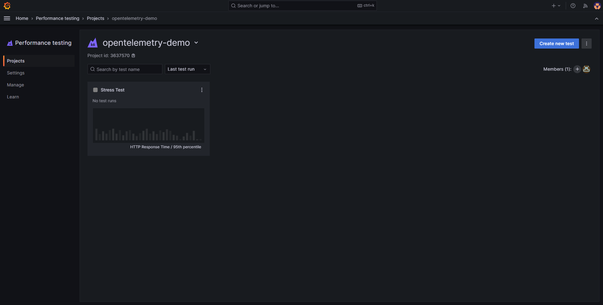
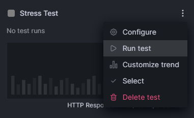
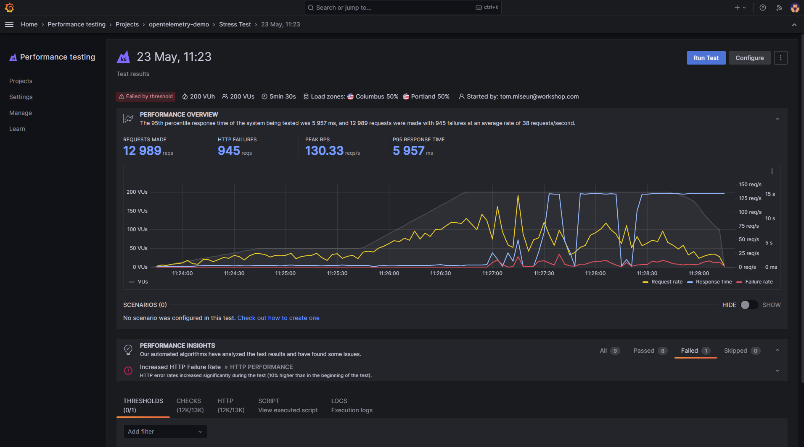
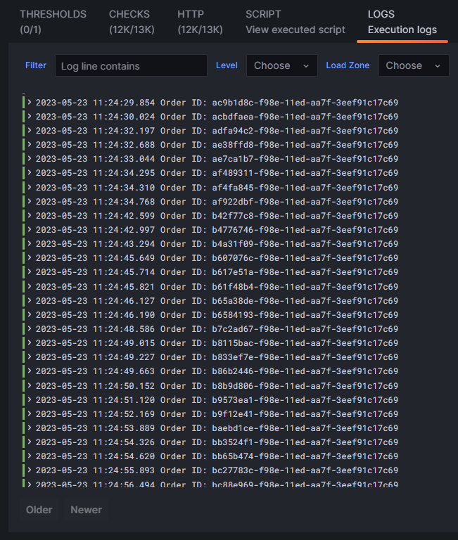
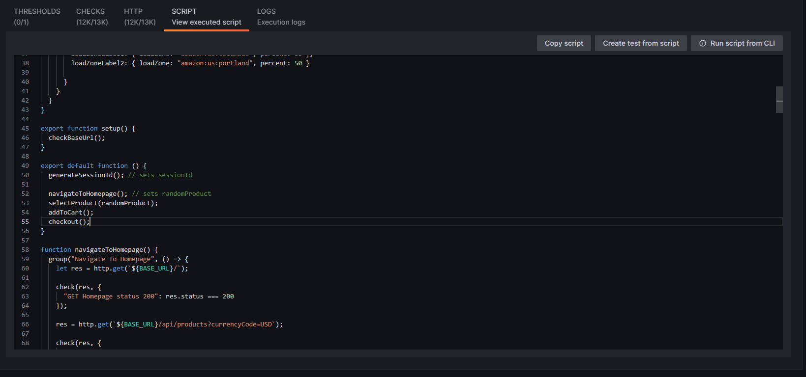
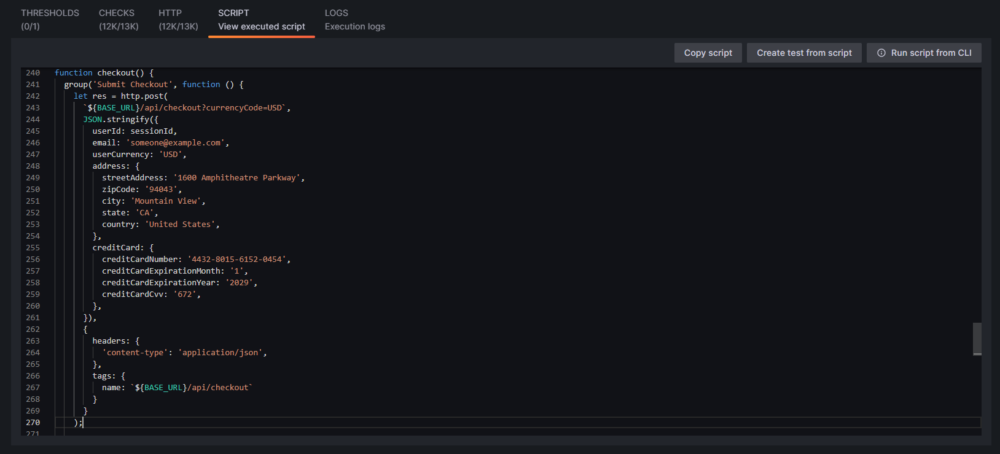
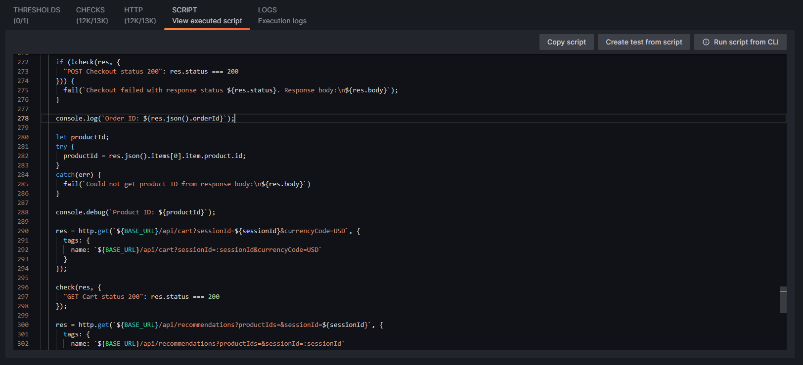

## Breakout 2: Running tests in the Cloud

In this breakout, we'll be running a pre-configured k6 test available in your Grafana Cloud stack.

Although we've done our best to ensure the demo app will fail under pressure, it's not guaranteed. This is a bit of a reality with load testing, and is why it's important to run tests multiple times. The test only runs for a few minutes, and so you should be able to run a few tests during the breakout, and hopefully see some interesting things happen in at least one of those tests.

### 1: Running the test

The test we are looking for is called `Stress Test`. It can be found in `Performance Testing` -> `Projects` -> `opentelemetry-demo`:



Click on the "burger icon" and select `Run test` to start the test:



Doing so will cause the UI to display the test startup animation, along with giving a progress bar and status updates. After about 30 seconds, the page will redirect you to the test run UI where the progress of the test can be viewed in real-time. Once the test has finished, the screen should look something like this:



The test will take a few minutes to complete, so lets use this time to explore the test run UI.

### 2: Inspecting logs

By the time the test has started, there should already be some logs available to look at. To view them, click on the `Logs` tab:



Should the test be running as expected, the only log messages that should appear here are those printing out Order IDs. These Order IDs are generated on the server-side, and so they are useful for verifying that the test is actually creating orders as expected.

What might be useful to do now is to look at the script code that's printing out these logs. To do so, navigate to the `Script` tab, then scroll down until you can see line 55:



The function call on line 55 is called `checkout` - this is the one we're interested in.

It is located within the `default function`, which is the function that the VUs will execute repeatedly until the test ends. This function in turn calls other functions defined further down in the script, of which one of them is `checkout`. Separatingcode out into functions like this has two advantages: function re-use, and readability.

The `checkout` function itself can be found on line 240:



The checkout transaction - when executed through the browser - actually consists of a sequence of HTTP requests. It might be interesting to capture the time it takes the whole sequence to complete - this is the purpose behind the built-in `group` function. 

At the start of the `group` function, we are making a POST request with some JSON payload. We set the `Content-Type` header to `application/json`, and we also add a `tag` to the request. This `tag`, with the property value `name`, will modify how the request is displayed in the HTTP tab, overwriting the URL with whatever is passed to the `name` tag. In this case, we're just chopping off the query string portion of the URL (i.e. the `?currencyCode=USD` part). This is how you would aggregate requests that are for the same endpoint but may have slightly different parameters (in this case, there are none, but it's still considered good practice to tag requests).

Scroll down a bit and you'll see a `check` function, followed by the `console.log` statement we're looking for:



The `check` is used to confirm whether we received the expected HTTP status code 200. Should that not have been the case, the built-in `fail` function will be called. `fail` will terminate the iteration at this point, as well as print out an error message that includes the `response.body` to aid debugging.

### 3: Looking at test results

Hopefully, by this point, the test will have started receiving some errors. We are, after all, stress testing the application!

If you see some HTTP failures being logged, navigate back to the `Logs` tab to see what is being printed out.

Should the test have failed in the way it has been observed to fail during testing, there will likely be some combination of:

```
2023-05-23 11:27:02.728	
GoError: Checkout failed with response status 500. Response body:
Internal Server Error
	at go.k6.io/k6/js/modules/k6.(*K6).Fail-fm (native)
	at file:///tmp/qrmi8h/script.js:275:12(79)
	at go.k6.io/k6/js/modules/k6.(*K6).Group-fm (native)
	at checkout (file:///tmp/qrmi8h/script.js:241:8(6))
	at file:///tmp/qrmi8h/script.js:55:2(20)
 executor=ramping-vus scenario=default
```

And:

```
2023-05-23 11:29:16.113	
GoError: Checkout failed with response status 504. Response body:
upstream request timeout
	at go.k6.io/k6/js/modules/k6.(*K6).Fail-fm (native)
	at file:///tmp/qrmi8h/script.js:275:12(79)
	at go.k6.io/k6/js/modules/k6.(*K6).Group-fm (native)
	at checkout (file:///tmp/qrmi8h/script.js:241:8(6))
	at file:///tmp/qrmi8h/script.js:55:2(20)
 executor=ramping-vus scenario=default
```

If you have different errors being reported, please share it with the breakout leader!

There's a point to be made here (regardless of the errors received) that will feed into the next presentation that covers Instrumentation: the errors being reported here are not very helpful. They do not tell us what went wrong, or where. They do not tell us how to fix the problem. They do not tell us how to prevent the problem from happening again. This is a harsh reality for a lot of load testers, especially those that are not the developers of the thing they're testing. If the server does not provide any useful information in error responses, you're going to have to find answers elsewhere!

### That's it!

If there's time left in the breakout, feel free to run some more tests, or have a look through the other tabs like `Thresholds` and `Checks`.