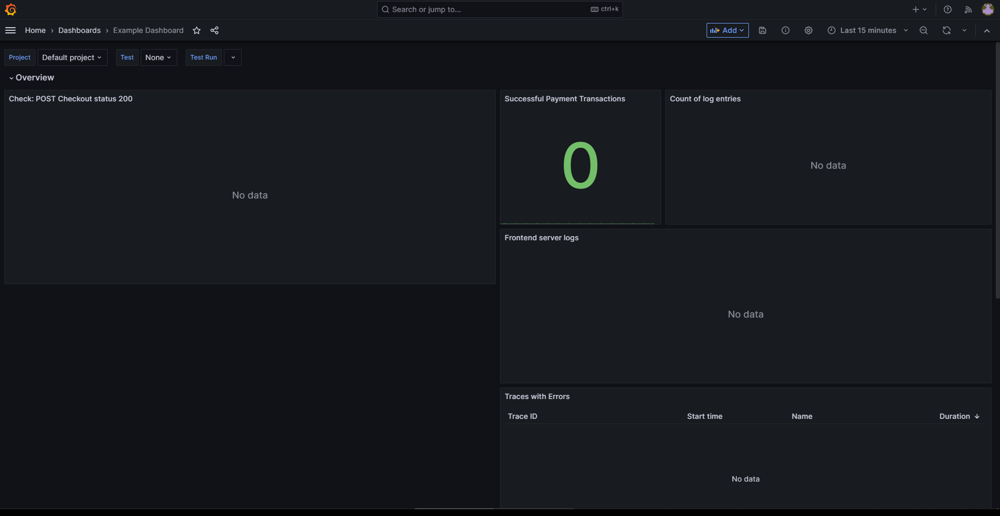
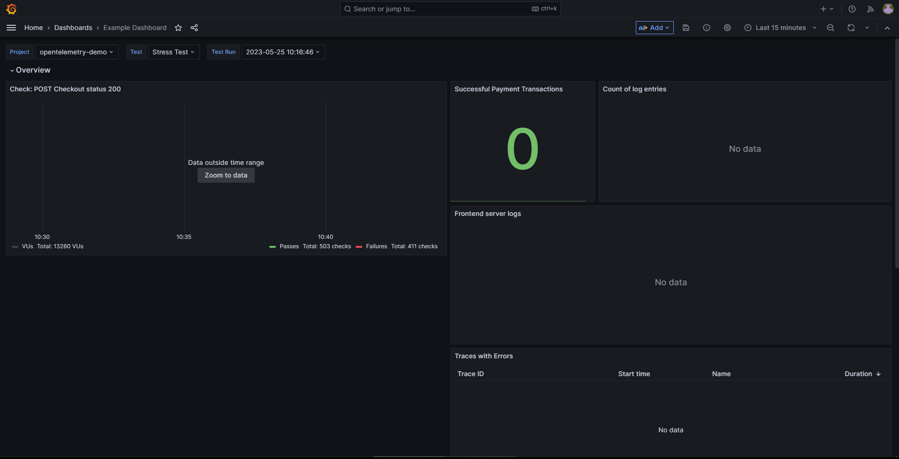
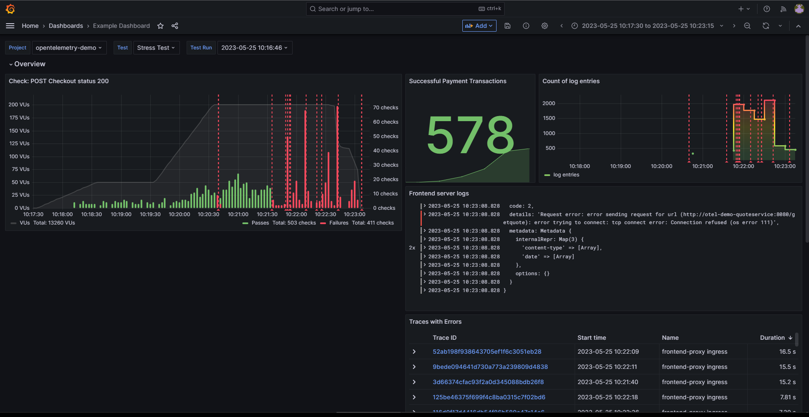
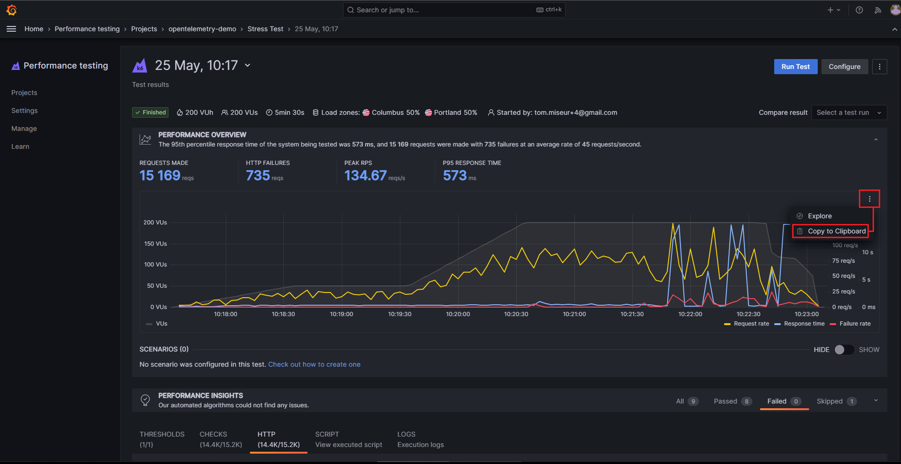
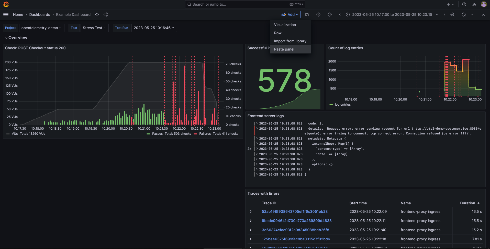
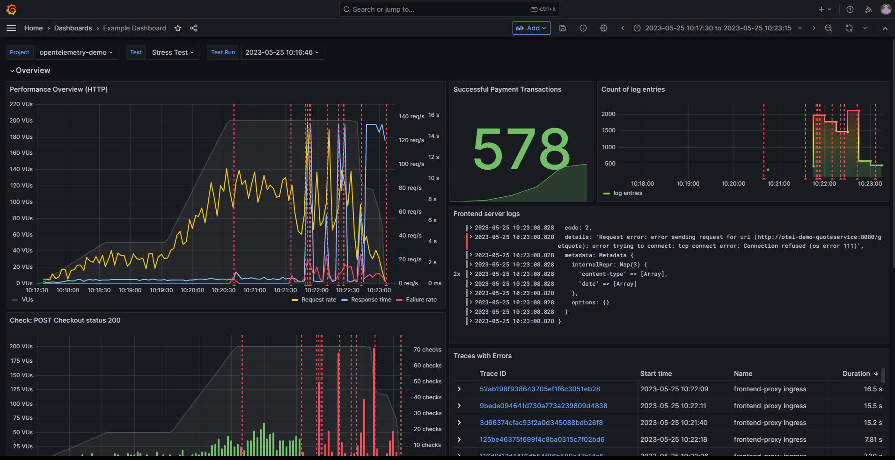
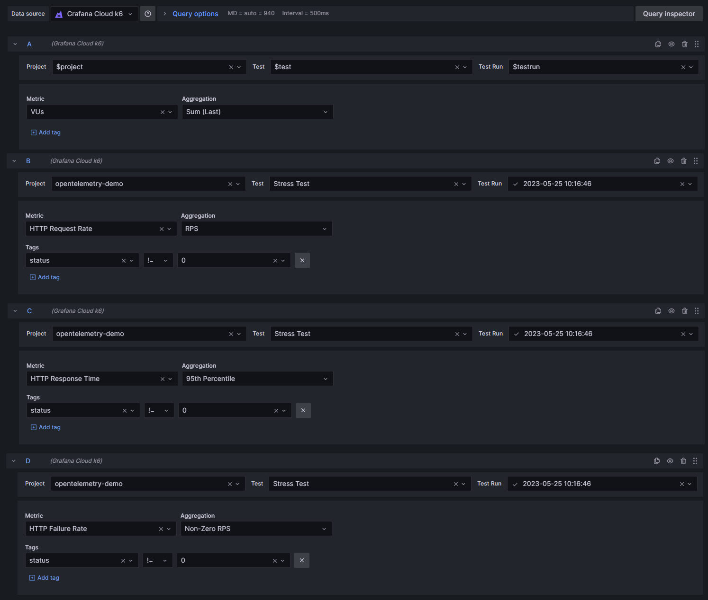
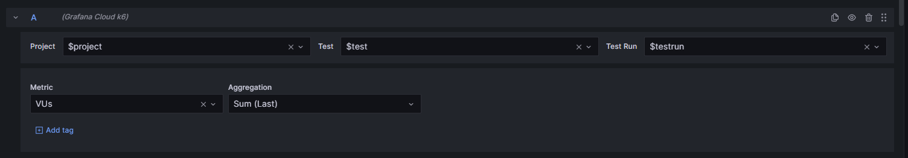
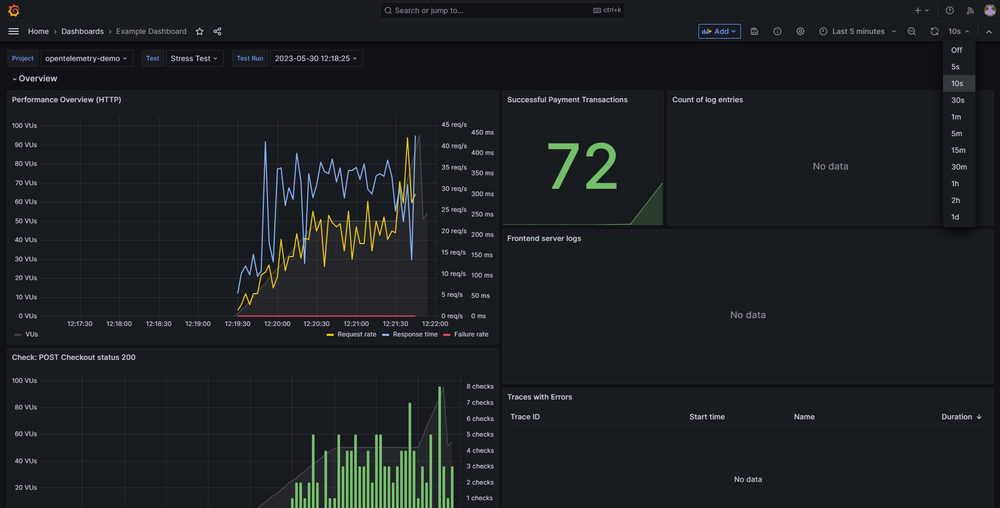

## Breakout 3: Building a correlated dashboard

This breakout will explore the dashboard that came pre-configured in your Grafana Cloud. It is the same dashboard that was used in the presentation, but with one panel missing - this is what we'll be building during the breakout.

### 1: Finding the dashboard

The dashboard we're after can be found under `Dashboards` -> `General` -> `Example Dashboard`. It should look something like this:

The reason it is empty upon first load is because we don't have a test run set. To set one, select a test using the Dashboard Variables dropdowns toward the top of the screen. The tests you've been running in previous breakouts should be available to select.

Select a test by setting `Project` to `opentelemetry-demo`, `Test` to `Stress Test`, and then finally a `Test Run` (the latest test run is probably the best one to pick).

Upon doing so, chances are that the test run data will not be visible in the current selected time range of `Last 15 minutes`. As a result, you should see a `Data outside time range` message along with a `Zoom to data` button on the `Check: POST Checkout status 200` panel:

Click on this button to have Grafana update the time range to match the test run's time range. This should cause all of the panels to update with the test run data:

There is an empty space on this dashboard that we want to fill with a new panel. The obvious way to add a panel would be with the `Add new panel` functionality, but instead of doing that, we'll be copying a panel from the Grafana Cloud k6 app and modifying it to suit our needs.

### 2: Copying panels from Grafana Cloud k6

Open up a new browser tab (as we'll want to come back to the dashboard). In this new tab, navigate to Grafana Cloud k6 and locate the same test run that was just selected using dashboard variables. You'll want to navigate all the way into the test results for that test run.

Once there, locate the "burger icon" toward the top-right of the `Performance Overview` time series, and select `Copy to Clipboard`:

At this point, we have the panel JSON in our clipboard, meaning we can paste it into the `Example Dashboard`. Go back to the previous tab and select the `Add` button next to the time range picker. There should now be an entry in the drop-down for `Paste panel`:

Select this option to paste the panel into the dashboard. Once it is on the dashboard, we'll want to adjust the size of it to fit the empty space in the dashboard. The panel should also exist in the `Overview` row. Simply drag the panel down into the `Overview` section, and then expand it downward to fill the empty space. The end result should look like this:

### 3: Modifying panel queries

What's important to note here is that the copied panel will be hard-coded to the test run that it came from. As this dashboard has already been set up with Dashboard Variables to allow us to view the results of *any* test run, we'll need to update the panel queries to use the variables as well.

Hover over the panel to reveal the burger icon, then select `Edit`. Doing so reveals that this panel is made up of 4 queries to the `Grafana Cloud k6` data source. The queries are bringing us back:

- VUs: the total number of VUs that are running at any given point in time in the test
- HTTP Request Rate: the number of HTTP requests that the VUs made, aggregated per second. In addition, there is a filter applied to this query to only count requests where the `status` `Tag` was not `0`. This means that we will only count requests that received some kind of response (in other words, timeouts would not be included in this metric).
- HTTP Response Time: the response time of HTTP requests, aggregated by the `95th Percentile`. Like the previous query, this query also has a filter applied to it to only include requests where the `status` `Tag` was not `0`.
- HTTP Failure Rate: here, we are bringing back the number of HTTP requests that failed, again filtering to only include requests where the `status` `Tag` was `0`.

To have these queries use the dashboard's Dashboard Variables, all we'll need to do is modify the `Project`, `Test`, and `Test Run` drop-downs for each of the queries (12 updates in total) and have them point to the respective `$...` variable values.

The queries should end up looking like this:

The display of the panel shouldn't actually change if the Dashboard Variables were set to the same test run that the panel was copied from. However, if you were to now change the Dashboard Variables to a different test run, you should see the panel update to reflect the new test run's data. With this small change, we've now made the panel dynamic, allowing us to view the results of any test run we want!

At this point, it's a good idea to `Save` the dashboard, so go ahead and click the floppy-disk icon and hit `Save`.

### 4: Viewing a running test

As well as providing us historical information when looking at previous test runs, the dashboard can also be used to view the results of a test run that is currently running.

To do so, switch back to the Grafana Cloud k6 tab where the `Performance Overview` panel was copied from. Hit the `Run Test` button to kick off another test run.

As soon as the test run has begun initializing, switch back to the dashboard tab. The dashboard will need to be refreshed for the new test run to appear in the list of `Test Runs` to select from. Select the `Test Run` and then update the time range picker to `Last 5 minutes`. You'll also want to set the dashboard to auto-update; a value of `10s` should suffice.

Doing so will show us the test run statistics as they come in:

### Wrapping up

At this point, the breakout is over, so feel free to look around the dashboard! For example, have a look at the traces that show up in the `Traces with Errors` panel. You could perhaps also add a new panel for one of the other metrics available in the `Grafana Cloud k6` data source, such as the `Group Duration` metric that gives us response times for the various `group` timings that are being generated by the test.
